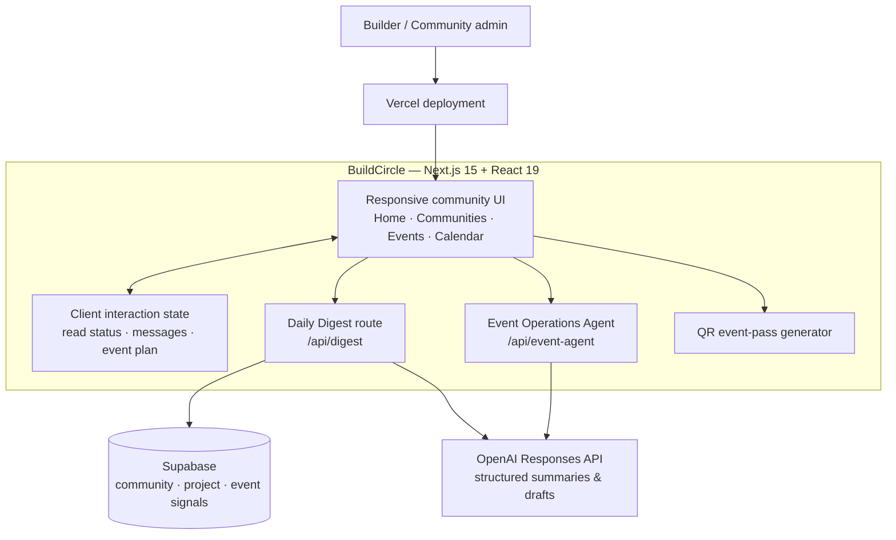
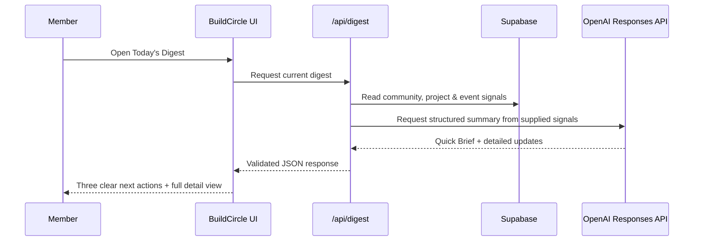

# BuildCircle

> **One high-signal home for builders to discover communities, share work, join events, and know exactly what matters next.**

[](https://buildcircle-puce.vercel.app/)
[](https://nextjs.org/)
[](https://platform.openai.com/)
[](https://supabase.com/)

**[Open the live demo →](https://buildcircle-puce.vercel.app/)**

## Contents

- [Overview](#overview)
- [Problem Statement](#problem-statement)
- [Solution](#solution)
- [Features](#features)
- [Architecture](#architecture)
- [Tech Stack](#tech-stack)
- [Codex / OpenAI Usage](#codex--openai-usage)
- [Demo](#demo)
- [How to Run Locally](#how-to-run-locally)
- [Additional Notes](#additional-notes)

## Overview

BuildCircle is a community operating system for people who build. Instead of scattering conversations across chat apps, events across ticketing tools, projects across feeds, and reminders across calendars, it gives builders one intentional place to learn, ship, find collaborators, and follow through.

The experience is designed around a simple principle: **less noise, more momentum.** Its AI Daily Digest turns live community, project, and event signals into a three-step action plan so a member can immediately decide what to do next.

## Problem Statement

Builder communities have no shortage of activity—but useful activity is fragmented and easy to miss.

- Important questions disappear in fast-moving chat streams.
- Promising projects and potential collaborators are difficult to surface at the right time.
- Event registration, passes, reminders, and calendars live in separate tools.
- Members spend time catching up instead of building.

## Solution

BuildCircle brings the core community loop into one polished workflow:

1. **Discover the right circle** — explore focused builder communities and request access to private ones.
2. **Contribute where it matters** — discuss in channels, reply in threads, share files, images, voice notes, and projects.
3. **Stay in motion** — register for events, keep a personal calendar, join a focus sprint, and use an AI brief to prioritize the next action.

## Why it stands out

| Traditional community experience | BuildCircle |
| --- | --- |
| Endless chronological chat | AI-assisted daily prioritization and actionable summaries |
| Separate event, calendar, and pass tools | Registration, QR pass, event planning, and calendar in one product |
| Generic group spaces | Purposeful communities with channels, announcements, member discovery, and admin controls |
| Passive browsing | Community Pulse focus sprints, weekly quests, and BuildTokens encourage meaningful participation |

## Features

### Communities that are built for momentum

- Explore public communities or request access to approval-based private communities.
- Switch circles instantly; each workspace has its own channels, member count, event context, and content.
- Create and manage channels, announcements, community descriptions, join requirements, file sharing, and read-only rooms.
- View members and start private conversations.

### Conversations that feel useful, not noisy

- Channels, message threads, replies, one-love-per-user reactions, and message actions.
- Image, file, project showcase, and in-browser voice-note sharing.
- Per-channel unread counts with functional **Mark as read** state.
- Direct messages, live builder rooms, and announcement-only channels.

### Community Pulse

- Join a timed focus sprint and earn BuildTokens for participating.
- Track a lightweight weekly quest.
- See who is actively building and the next relevant event without leaving the community workspace.

### Events, passes, and personal planning

- Browse and filter events, register, and access a QR event pass.
- Track registered and wishlisted events in a dedicated calendar.
- Select a date to see the events planned for that day.
- Use the Event Operations Agent to prepare reviewable community, email, and in-app messaging drafts.

### AI that turns activity into action

- **Quick Brief:** a concise “what happened / what to do next” summary with exactly three linked actions.
- **All updates:** the complete detailed digest remains one tap away.
- **Safe fallback:** if the AI service is unavailable, the app still provides a deterministic current-platform snapshot.
- OpenAI output is constrained to structured data and only the supplied platform signals.

### Discoverability and trust

- Platform-wide search across communities, discussions, people, topics, tags, and events.
- Read-aware notifications so badges clear when an update has been viewed.
- Responsive, accessible, premium Urbanist-based UI for desktop and mobile.

## Architecture



### How the AI flow works



## Tech Stack

| Layer | Technology |
| --- | --- |
| Frontend | Next.js 15, React 19, TypeScript, CSS |
| Backend | Next.js Route Handlers |
| Database / signals | Supabase |
| AI | OpenAI Responses API with structured JSON output |
| Event passes | `qrcode` |
| Deployment | [Vercel](https://buildcircle-puce.vercel.app/) |
| Developer workflow | Codex, GitHub, npm, TypeScript, production builds |

## Codex / OpenAI Usage

BuildCircle was built with AI as a practical development and product partner—not as a black box.

- **Ideation and architecture:** Codex helped turn the fragmented-community problem into a coherent product flow spanning communities, events, calendar, search, and prioritization.
- **Implementation:** Codex accelerated component construction, Next.js route design, structured API integration, QR passes, and responsive UI states.
- **OpenAI integration:** The Daily Digest and Event Operations Agent use the OpenAI Responses API to return constrained, structured data. The UI validates responses before rendering them.
- **Debugging and reliability:** Codex helped diagnose incomplete model output, tune the digest to concise low-reasoning generation, and preserve deterministic fallbacks.
- **UX, testing, and documentation:** Codex supported interaction fixes, desktop/mobile testing, accessibility labels, production-build checks, and this evaluation-ready README.

Human product decisions remain in control: AI receives only the platform context required for a summary or draft, and external communication remains reviewable before release.

## Demo

### Live Demo

**[https://buildcircle-puce.vercel.app/](https://buildcircle-puce.vercel.app/)**

### Recommended evaluation flow

1. Open **Today’s Digest** and review the AI-generated Quick Brief.
2. Switch to **All updates** to see the detailed source cards.
3. Visit **Communities** and open a circle to explore channels, read state, and Community Pulse.
4. Open **Events**, register for an event, and view the generated QR pass.
5. Visit **Calendar** to review registered and wishlisted event planning.

### Demo / pitch video

> Add the final video link here before submission.

A 60–90 second pitch should show the flow above and explain how BuildCircle turns fragmented builder activity into an actionable daily workflow.

## Screenshots

> Add final product screenshots before submission. These are the most persuasive frames to include:

| Screen | What to show |
| --- | --- |
| Home + Daily Digest | AI Quick Brief with three actions and the All updates view |
| Community workspace | Channels, read state, Community Pulse, and a shared project or voice note |
| Events | Registration flow and QR event pass |
| Calendar | Registered and wishlisted events on the monthly view |

## How to Run Locally

### Prerequisites

- Node.js 20 or newer
- npm
- A Supabase project for live platform signals *(optional; seeded fallback content is included)*
- An OpenAI API key for AI-curated digests and event-operation drafts *(optional; safe fallbacks are included)*

### Installation

```bash
git clone https://github.com/geo-cherian-mathew-2k28/buildcircle.git
cd buildcircle
npm install
```

Create a `.env` file at the project root. **Never commit this file or expose its values.**

```bash
# Supabase — server-side keys stay on the server
SUPABASE_URL=your_supabase_url
SUPABASE_PUBLISHABLE_KEY=your_supabase_publishable_key
SUPABASE_SECRET_KEY=your_supabase_secret_key

# OpenAI — enables AI-curated Digest and Event Operations Agent
OPENAI_API_KEY=your_openai_api_key
OPENAI_MODEL=gpt-5-mini
```

Start the development server:

```bash
npm run dev
```

Then open [http://localhost:3000](http://localhost:3000).

### Production check

```bash
npm run build
npm run start
```

## Additional Notes

BuildCircle is a working deployed prototype focused on demonstrating the full member journey. It deliberately keeps a few production-scale capabilities staged for the next iteration:

- Supabase Auth and row-level security for persistent identity and moderator approvals.
- Persistent chat, media storage, real-time presence, and delivery-grade notifications.
- A verified transactional-email provider for releasing host-approved event communication.
- Community analytics, moderation audit logs, and richer event check-in tooling.
- Final submission screenshots and a short pitch video.

## Team note

BuildCircle is designed to make the next useful builder action obvious—whether that is answering a question, giving feedback, joining an event, or simply making focused progress together.

---

Built for builders who would rather ship than scroll.
